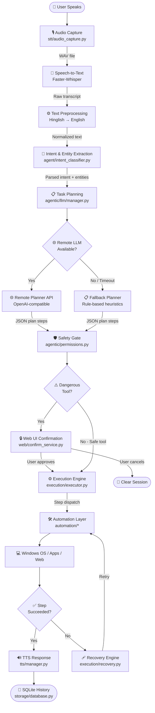
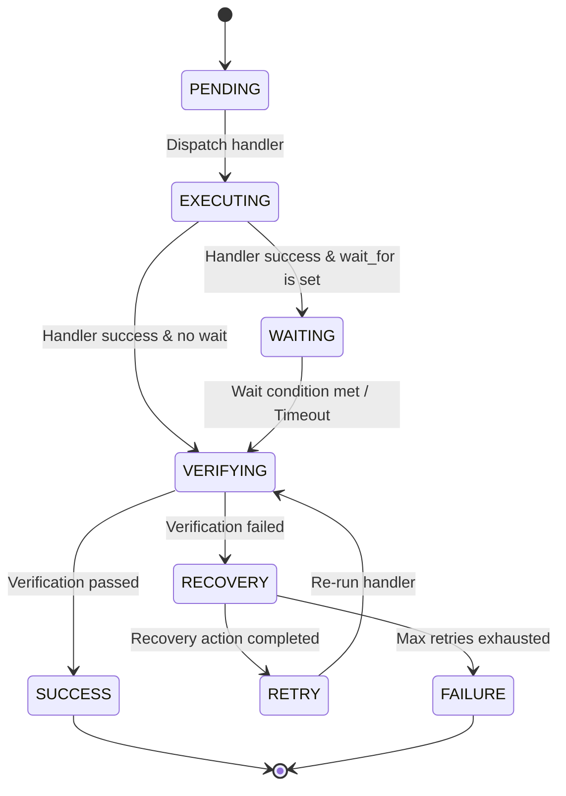
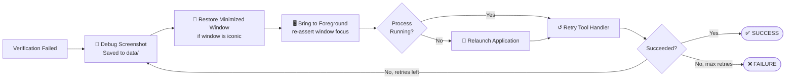

<div align="center">


<br/><br/>

# 🎙️ AI Voice Assistant

### *Speech → Plan → Action. Hands-free Windows desktop control powered by local AI.*

A Windows-native voice automation assistant that translates natural speech (including **Hinglish**) into executable OS action graphs — launching apps, browsing the web, managing files, and sending messages, all without touching a mouse.

<br/>

[ ·
[Architecture](#-system-architecture) ·
[Installation](#-installation-guide) ·
[Usage Examples](#-usage-examples) ·
[Roadmap](#-roadmap)]

</div>

---

## 📋 Table of Contents

| Section | Description |
|---|---|
| [🎬 Demo](#-demo) | Screenshots and GIF placeholders |
| [🔍 Project Overview](#-project-overview) | What it is, what problem it solves |
| [✨ Features](#-features) | Full feature matrix |
| [🔄 Project Workflow](#-project-workflow) | End-to-end Mermaid flowchart |
| [🏗 System Architecture](#-system-architecture) | Component diagram and data flows |
| [⚙️ Detailed Execution Pipeline](#-detailed-execution-pipeline) | Stage-by-stage breakdown |
| [🔁 Stateful Execution Engine](#-stateful-execution-engine) | State machine, wait utils, recovery |
| [📁 Folder Structure](#-folder-structure) | Directory tree |
| [🧩 Module Explanation](#-module-explanation) | Per-module reference |
| [🛠 Technology Stack](#-technology-stack) | Libraries and frameworks |
| [⚙️ Configuration](#️-configuration) | Environment variables |
| [🚀 Installation Guide](#-installation-guide) | Setup steps and troubleshooting |
| [💬 Usage Examples](#-usage-examples) | Voice → Plan → Result walkthroughs |
| [🧪 Testing](#-testing) | Test suite overview |
| [⚠️ Current Limitations](#️-current-limitations) | Honest capability boundaries |
| [🗺 Roadmap](#-roadmap) | Planned improvements checklist |

---

## 🎬 Demo

<div align="center">

<!-- PLACEHOLDER: Replace with actual demo GIF (screen recording of voice command → app launch) -->
> 📹 **Demo GIF** — *Record a short screen capture of a voice command and drop it here.*
> Suggested: `docs/assets/demo.gif`

```
┌─────────────────────────────────────────────────────┐
│                                                     │
│          [ 🎬 Demo GIF Placeholder ]                │
│      Voice command → App launches automatically     │
│                                                     │
└─────────────────────────────────────────────────────┘
```

<!-- PLACEHOLDER: Dashboard screenshot -->
> 🖥️ **Dashboard Screenshot** — `docs/assets/dashboard.png`

<!-- PLACEHOLDER: Confirmation dialog screenshot -->
> 🔒 **Safety Confirmation Dialog** — `docs/assets/confirm_dialog.png`

<!-- PLACEHOLDER: Voice recording animation -->
> 🎤 **Voice Recording Waveform** — `docs/assets/recording_animation.gif`

<!-- PLACEHOLDER: Execution result screenshot -->
> ✅ **Execution Result Panel** — `docs/assets/execution_result.png`

</div>

---

## 🔍 Project Overview

### What is this project?

This project is a Windows-compatible voice-control application that maps **speech or text inputs** to executable **action graphs (plans)** on the host computer. It combines:

- 🎤 **Local speech-to-text** (Faster-Whisper, quantized model inference)
- 🧠 **Pattern-based NLP** (intent classification + entity slot extraction)
- 🌐 **LLM task planning** (remote OpenAI-compatible API with offline fallback)
- 🖥️ **Programmatic GUI/web drivers** (PyAutoGUI, Win32 APIs, Playwright)

### What problem does it solve?

It eliminates manual user interaction — mouse clicking, keyboard typing, directory navigating, menu searching — for common desktop workflows. By listening to natural commands, it:

- Compiles resource locations
- Launches applications
- Searches directories and the web
- Sends messages
- Manages files

...all completely hands-free.

### Who is it for?

| Audience | Use Case |
|---|---|
| 🧑‍💻 Power users | Hands-free desktop control via voice |
| ♿ Accessibility developers | Building system integrations for users with mobility impairments |
| 🤖 Automation engineers | Exploring voice-driven OS agent execution |

### How is it different from a basic speech recognizer?

A basic speech recognizer only transcribes audio to text. This assistant:

- Parses **semantic intents** and resolves contextual references (*"it"*, *"here"*)
- **Dynamically indexes** the local system to find resource targets
- Manages **stateful execution logs** in an SQLite database
- **Stops dangerous operations** using confirmation guards
- Runs **recovery blocks** (screenshot capture, window refocus) when steps fail

---

## ✨ Features

> Only features **fully implemented** in the codebase are listed below.

| Feature | Module | Status |
|---|---|:---:|
| 🎤 Voice Recording (silence detection) | `stt/audio_capture.py` | ✅ |
| 📝 Local Speech-to-Text (Faster-Whisper) | `stt/whisper_engine.py` | ✅ |
| 🌐 Remote STT (Colab GPU server) | `stt/` + `.env` | ✅ |
| 🔤 Hinglish Normalization | `agent/preprocess.py` | ✅ |
| 🧠 Intent Classification | `agent/intent_classifier.py` | ✅ |
| 🎯 Entity Slot Extraction | `agent/entity_extractor.py` | ✅ |
| 📡 Remote LLM Planner | `agentic/llm/manager.py` | ✅ |
| 📋 Rule-Based Fallback Planner | `agentic/llm/fallback.py` | ✅ |
| 🔍 Desktop Resource Discovery | `agentic/discovery/indexer.py` | ✅ |
| 🛡️ Safety Confirmation Gate | `agentic/permissions.py` | ✅ |
| 🖥️ Desktop & Win32 Automation | `automation/desktop.py` | ✅ |
| 📂 File System Management | `automation/filesystem.py` | ✅ |
| 🌍 Browser Automation | `automation/browser.py` | ✅ |
| 💬 WhatsApp Web Automation | `automation/whatsapp.py` | ✅ |
| 🔊 Neural TTS (Edge-TTS) | `tts/edge_engine.py` | ✅ |
| 🔈 Offline TTS Fallback (Pyttsx3) | `tts/pyttsx3_engine.py` | ✅ |
| 💾 SQLite Session History | `storage/database.py` | ✅ |
| 🔄 Stateful Execution Engine | `execution/executor.py` | ✅ |
| 🩹 Automated Failure Recovery | `execution/recovery.py` | ✅ |
| 🌐 Flask Web Dashboard | `web/app.py` | ✅ |
| 🔗 Multi-step Execution Workflows | — | 🚧 Partial |
| 👁️ OCR / Vision Integration | — | 🔲 Planned |
| 🔔 Wake Word Detection | — | 🔲 Planned |

---

## 🔄 Project Workflow

The complete end-to-end pipeline from voice input to system action:



---

## 🏗 System Architecture

The following diagram maps all components and their data flows:


---

## ⚙️ Detailed Execution Pipeline

<details>
<summary><strong>📖 Click to expand all pipeline stages</strong></summary>

### Stage 1 — Audio Capture

| Property | Value |
|---|---|
| **Module** | `stt/audio_capture.py` |
| **Input** | Physical acoustic signals from microphone |
| **Output** | Temporary `.wav` file path on disk |
| **Key Classes** | `AudioRecorder` |
| **Key Functions** | `record()`, `record_until_silence()` |
| **Failure Cases** | No default microphone, sounddevice query failure |
| **Recovery** | Falls back to warning logs and empty recording blocks |

---

### Stage 2 — Speech-to-Text

| Property | Value |
|---|---|
| **Module** | `stt/whisper_engine.py` |
| **Input** | WAV file path |
| **Output** | `TranscriptionResult` — transcribed text, language details, timing |
| **Key Classes** | `WhisperSTT` |
| **Key Functions** | `transcribe()` |
| **Model** | `deepdml/faster-whisper-large-v3-turbo-ct2` |
| **GPU Mode** | `float16` on CUDA, `int8` on CPU |
| **Failure Cases** | Model download failure, CPU float conversion errors |
| **Recovery** | Outputs empty transcripts and logs warnings |

---

### Stage 3 — Text Preprocessing

| Property | Value |
|---|---|
| **Module** | `agent/preprocess.py` |
| **Input** | Raw text string |
| **Output** | Normalized, clean English string |
| **Key Classes** | `TextPreprocessor` |
| **Key Functions** | `normalize_text()`, `tokenize()` |
| **Capabilities** | Hinglish → English, typo correction, punctuation removal |
| **Failure Cases** | Long strings with non-ASCII symbols |
| **Recovery** | Keeps raw alphanumeric tokens, discards unmapped symbols |

---

### Stage 4 — Intent & Entity Extraction

| Property | Value |
|---|---|
| **Modules** | `agent/intent_classifier.py`, `agent/entity_extractor.py` |
| **Input** | Normalized string |
| **Output** | `CommandIntent` — intent string, entities dict, confidence score |
| **Key Classes** | `IntentClassifier`, `EntityExtractor` |
| **Key Functions** | `classify()`, `extract_entities()`, `rank_intents()` |
| **Failure Cases** | Sentence matches multiple conflicting patterns |
| **Recovery** | Splits on conjunctions; returns highest-scoring intent |

---

### Stage 5 — Planning Layer

| Property | Value |
|---|---|
| **Modules** | `agentic/llm/manager.py`, `agentic/llm/fallback.py` |
| **Input** | Transcript string + system discovery context dict |
| **Output** | `PlannerOutput` — reasoning + list of action steps |
| **Key Classes** | `PlannerManager` |
| **Key Functions** | `plan()`, `apply_heuristic_fallback()`, `_inject_context()` |
| **Failure Cases** | Remote API timeout, JSON schema mismatch |
| **Recovery** | Activates `apply_heuristic_fallback()` for offline rule-based planning |

---

### Stage 6 — Safety Gate

| Property | Value |
|---|---|
| **Modules** | `agentic/tool_registry.py`, `web/confirm_service.py` |
| **Input** | `PlannerOutput` plan step details |
| **Output** | Execution permit OR blocked confirmation UUID |
| **Key Classes** | `PermissionManager`, `PendingActionManager` |
| **Key Functions** | `check_permissions()`, `handle_confirm()` |
| **Failure Cases** | User closes browser during a safety block |
| **Recovery** | Ephemeral confirmation states expire automatically after 60 seconds |

---

### Stage 7 — Execution Engine

| Property | Value |
|---|---|
| **Module** | `execution/executor.py` |
| **Input** | `ExecutionPlan` with action steps (`wait_for`, `timeout`, `requires`) |
| **Output** | List of step-by-step results with lifecycle states |
| **Key Classes** | `DesktopExecutor`, `StepRecord`, `ExecutionContext`, `StepStatus` |
| **Key Functions** | `execute()`, `execute_step()`, `dispatch_wait()`, `dispatch_verify()`, `recover_step()` |
| **Failure Cases** | App unresponsive, window fails to load, UI focus mismatch |
| **Recovery** | State machine: screenshot → restore → focus → relaunch → retry (up to `max_retries`, default: 2) |

---

### Stage 8 — Automation Layer

| Property | Value |
|---|---|
| **Module** | `automation/*` |
| **Input** | Execution payload arguments |
| **Output** | `ExecutionResult` model |
| **Drivers** | PyAutoGUI, Win32 APIs, Playwright, `subprocess`, `webbrowser` |
| **Key Functions** | `open_application()`, `open_browser()`, `open_folder()`, `send_whatsapp_message()` |
| **Failure Cases** | Playwright Chromium locks, OS lock-screen blocks |
| **Recovery** | Returns failed `ExecutionResult` to trigger executor recovery logic |

</details>

---

## 🔁 Stateful Execution Engine

The execution engine is built around a **state-aware sequential state machine** that validates each action before proceeding to the next step.

### Step Lifecycle



| State | Description |
|---|---|
| `PENDING` | Step is queued and waiting to run |
| `EXECUTING` | Registered tool handler is actively running |
| `WAITING` | Engine is polling for a post-execution readiness condition |
| `VERIFYING` | Engine checks OS state to confirm the step's intent was achieved |
| `RECOVERY` | Verification failed; recovery engine applies corrective strategies |
| `RETRY` | Tool handler is executed again after recovery |
| `SUCCESS` | Terminal: step completed successfully |
| `FAILURE` | Terminal: remaining plan steps are aborted |

---

### Intelligent Wait Utilities

Instead of bare `time.sleep()` calls, the engine uses condition-polling primitives from `execution/wait_utils.py`:

| Utility | Condition Polled |
|---|---|
| `wait_until_process_running(name)` | `psutil` process list — waits until app appears |
| `wait_until_window_exists(title)` | `win32gui` — waits until window title is visible |
| `wait_until_window_active(title)` | Waits for target window to become foreground |
| `wait_until_application_ready(name)` | Composite: process + window + active |
| `wait_until_element_ready(label)` | Polls coordinate locators for a specific UI element |
| `wait_until_browser_loaded()` | Monitors browser window title stability |

Each utility supports configurable **timeouts** and **polling intervals**.

---

### Post-Step Verification

After execution (and any optional wait phase), the system performs best-effort OS validation:

| Tool Type | Verification Method |
|---|---|
| Application launch | Process running + visible window confirmed |
| Window focus | Window title visible and in foreground |
| Text typing / key press | Fire-and-forget (always passes — keystroke is not inspectable) |
| Search inside app | Application window still active |

---

### Automated Failure Recovery

If a step fails verification, the engine applies recovery strategies in priority order (up to `max_retries = 2`):



---

### Planner Step JSON Format

The planner outputs step metadata fields (`wait_for`, `timeout`, `requires`) that the executor parses and enforces:

```json
{
  "thought": "Open Spotify and search Believer",
  "steps": [
    {
      "tool": "launch_application",
      "args": { "application": "spotify" },
      "wait_for": "window_ready",
      "timeout": 20
    },
    {
      "tool": "search_inside_application",
      "args": { "query": "Believer" },
      "requires": "Spotify Ready"
    }
  ],
  "response": "Opening Spotify and searching for Believer."
}
```

> Step N does not execute until step N-1 has been fully **verified** and declared **ready**.

---

## 📁 Folder Structure

```
ai-voice-assistant/
│
├── 🧠 agent/                          # Local NLP pipeline (text → intent)
│   ├── preprocess.py                  # Hinglish normalization, tokenization
│   ├── intent_classifier.py           # Keyword scoring + regex pattern matcher
│   ├── entity_extractor.py            # Slot parameter extraction
│   ├── command_registry.py            # Intent definitions and categories
│   └── schemas.py                     # NLP data models
│
├── 🤖 agentic/                        # High-level agent: planning, memory, discovery
│   ├── llm/
│   │   ├── manager.py                 # Remote + fallback planner orchestrator
│   │   ├── fallback.py                # Rule-based offline planner
│   │   ├── remote_client.py           # OpenAI-compatible API client
│   │   └── schemas.py                 # Planner output models
│   ├── discovery/
│   │   ├── indexer.py                 # Background daemon: scans apps/files/bookmarks
│   │   ├── apps.py                    # UWP + registry app scanner
│   │   ├── browser.py                 # Browser bookmark/history extractor
│   │   └── manager.py                 # Resource resolution router
│   ├── memory/
│   │   ├── session_state.py           # Singleton session context tracker
│   │   ├── app_context.py             # Active app/window state
│   │   └── pending_action.py          # Confirmation payload manager
│   ├── conversation/
│   │   └── confirmation_manager.py    # Multi-turn confirmation flows
│   ├── permissions.py                 # Safety gate + tool permission checks
│   └── schemas.py                     # ExecutionPlan, ActionStep models
│
├── 🛠 automation/                     # Low-level OS drivers
│   ├── applications.py                # App launch, window focus, process management
│   ├── browser.py                     # Web browser + search launcher
│   ├── desktop.py                     # Keyboard/mouse simulation, screenshots
│   ├── filesystem.py                  # Folder/file CRUD operations
│   └── whatsapp.py                    # Playwright WhatsApp Web automation
│
├── ⚙️ execution/                      # Step-execution state machine
│   ├── executor.py                    # Stateful DesktopExecutor lifecycle
│   ├── registry.py                    # Tool name → handler function map
│   ├── verifier.py                    # Post-step OS state verification
│   ├── recovery.py                    # Failure recovery strategy engine
│   ├── wait_utils.py                  # Intelligent condition-polling primitives
│   ├── step_state.py                  # StepRecord, StepStatus, ExecutionContext
│   └── schemas.py                     # ExecutionResult, ExecutionTimer
│
├── 🗣 stt/                            # Speech input processing
│   ├── audio_capture.py               # Microphone recording + silence detection
│   └── whisper_engine.py              # Faster-Whisper STT engine wrapper
│
├── 🔊 tts/                            # Voice response synthesis
│   ├── manager.py                     # TTSManager: engine selector + coordinator
│   ├── edge_engine.py                 # Neural Edge-TTS async client
│   ├── pyttsx3_engine.py              # Offline system TTS fallback
│   └── response_generator.py         # Execution outcome → natural language
│
├── 💾 storage/                        # Persistence layer
│   ├── database.py                    # SQLite CRUD operations
│   └── history_manager.py             # Session log manager
│
├── 🌐 web/                            # Flask web dashboard + REST API
│   ├── app.py                         # App factory + server entry point
│   ├── routes.py                      # REST endpoint definitions
│   ├── services.py                    # Core voice pipeline orchestration
│   └── confirm_service.py             # Safety confirmation webhook handler
│
├── 🧪 tests/                          # 24-file test suite
├── 📜 scripts/                        # Dev utilities and diagnostic tools
├── 📊 data/                           # Recovery screenshots, debug artifacts
├── 🎵 audio_recordings/               # Captured WAV files
├── config.py                          # Central configuration (loaded from .env)
├── .env.example                       # Environment variable template
└── requirements.txt                   # Pinned Python dependencies
```

---

## 🧩 Module Explanation

<details>
<summary><strong>🧠 NLP Agent Layer — click to expand</strong></summary>

### `agent/preprocess.py`

| Field | Detail |
|---|---|
| **Purpose** | Translates Hinglish → English, fixes typos, removes punctuation |
| **Classes** | `TextPreprocessor` |
| **Functions** | `normalize_text()`, `tokenize()` |
| **Input** | Raw string text |
| **Output** | Normalized clean string or token list |
| **Dependencies** | `re`, `logging` |
| **Called By** | `agent/intent_classifier.py` |

---

### `agent/intent_classifier.py`

| Field | Detail |
|---|---|
| **Purpose** | Matches normalized text to named intents via keyword scoring and regex |
| **Classes** | `IntentClassifier` |
| **Functions** | `classify()`, `rank_intents()` |
| **Input** | Clean normalized string |
| **Output** | `CommandIntent` structures |
| **Dependencies** | `re`, `dataclasses`, `command_registry`, `entity_extractor` |
| **Called By** | `web/services.py` |

---

### `agent/entity_extractor.py`

| Field | Detail |
|---|---|
| **Purpose** | Extracts slot variables from transcripts (app names, paths, contacts, queries) |
| **Classes** | `EntityExtractor` |
| **Functions** | `extract_entities()` |
| **Input** | Utterance string + intent parameters |
| **Output** | Dict of extracted slot values |
| **Dependencies** | `logging`, `re` |
| **Called By** | `agent/intent_classifier.py` |

---

### `agent/command_registry.py`

| Field | Detail |
|---|---|
| **Purpose** | Defines all supported intents, categories, and regex patterns |
| **Functions** | `get_all_intents()`, `get_intent()`, `list_intent_names()` |
| **Output** | `IntentDefinition` models |
| **Called By** | `agent/intent_classifier.py` |

</details>

<details>
<summary><strong>🤖 Planning & Discovery Layer — click to expand</strong></summary>

### `agentic/llm/manager.py`

| Field | Detail |
|---|---|
| **Purpose** | Orchestrates remote planning requests and offline fallbacks |
| **Classes** | `PlannerManager` |
| **Functions** | `plan()`, `_inject_context()` |
| **Input** | Transcription string |
| **Output** | `PlannerOutput` plan step models |
| **Dependencies** | `json`, `requests`, `fallback.py`, `discovery/indexer.py` |
| **Called By** | `web/services.py` |

---

### `agentic/llm/fallback.py`

| Field | Detail |
|---|---|
| **Purpose** | Rule-based planner mapping transcriptions to steps when offline |
| **Functions** | `apply_heuristic_fallback()` |
| **Input** | Transcript string |
| **Output** | `PlannerOutput` plan steps |
| **Called By** | `agentic/llm/manager.py` |

---

### `agentic/discovery/indexer.py`

| Field | Detail |
|---|---|
| **Purpose** | Background daemon scanning and indexing system apps and folders |
| **Classes** | `SystemIndexer` |
| **Functions** | `start()`, `stop()`, `scan_and_save()` |
| **Output** | Caches `system_index.json` on disk |
| **Scans** | UWP apps, registry, browser bookmarks/history, filesystem |
| **Called By** | `agentic/llm/manager.py` |

---

### `agentic/memory/session_state.py`

| Field | Detail |
|---|---|
| **Purpose** | Singleton session context tracking active apps, contacts, pending actions |
| **Classes** | `SessionState` |
| **Functions** | `set_context()`, `set_pending_action()`, `add_history()`, `get_session()` |
| **Dependencies** | `uuid`, `time`, `threading` |
| **Called By** | `web/services.py`, `agentic/llm/manager.py`, `execution/executor.py` |

</details>

<details>
<summary><strong>🛠 Automation Drivers — click to expand</strong></summary>

### `automation/applications.py`

| Field | Detail |
|---|---|
| **Purpose** | Launch process handles, enumerate running windows, foreground focus management |
| **Functions** | `open_application()`, `bring_process_to_foreground()`, `force_focus_window()` |
| **Dependencies** | `psutil`, `win32gui`, `win32process`, `subprocess` |

---

### `automation/browser.py`

| Field | Detail |
|---|---|
| **Purpose** | Launch web links and perform web searches |
| **Functions** | `open_browser()`, `search_web()` |
| **Dependencies** | `webbrowser` |

---

### `automation/filesystem.py`

| Field | Detail |
|---|---|
| **Purpose** | Create files/folders, read content, list files, delete targets |
| **Functions** | `create_folder()`, `create_file()`, `list_files()`, `delete_file()` |
| **Dependencies** | `os`, `shutil` |

---

### `automation/desktop.py`

| Field | Detail |
|---|---|
| **Purpose** | Low-level keyboard and mouse simulation, screenshots, memory check |
| **Functions** | `click()`, `type_text()`, `press_key()`, `take_screenshot()` |
| **Dependencies** | `pyautogui`, `psutil` |

---

### `automation/whatsapp.py`

| Field | Detail |
|---|---|
| **Purpose** | Automate sending messages on WhatsApp Web |
| **Functions** | `send_whatsapp_message()` |
| **Dependencies** | `playwright.sync_api` |
| **Note** | Requires manual QR code login on first run |

</details>

<details>
<summary><strong>⚙️ Execution Engine — click to expand</strong></summary>

### `execution/executor.py`

| Field | Detail |
|---|---|
| **Purpose** | Stateful, sequential plan execution with lifecycle management |
| **Classes** | `DesktopExecutor` (alias: `SystemExecutor`) |
| **Functions** | `execute()`, `execute_step()`, `_run_step_lifecycle()`, `_verify_and_recover()` |
| **Dependencies** | `execution/registry`, `execution/wait_utils`, `execution/verifier`, `execution/recovery` |

---

### `execution/registry.py`

| Field | Detail |
|---|---|
| **Purpose** | Maps string step tool names → automation handler functions |
| **Functions** | `register_tool()`, `get_handler()`, `load_all_tools()` |

---

### `execution/verifier.py`

| Field | Detail |
|---|---|
| **Purpose** | Post-step OS state verification (process running + window visible) |
| **Functions** | `dispatch_verify()`, `verify_application_launched()`, `_enumerate_all_windows()` |

---

### `execution/recovery.py`

| Field | Detail |
|---|---|
| **Purpose** | Structured failure recovery: restore → focus → relaunch → retry |
| **Functions** | `recover_step()`, `bring_to_foreground()`, `restore_minimized_window()`, `relaunch_application()` |

</details>

<details>
<summary><strong>🗣 STT / TTS / Storage — click to expand</strong></summary>

### `stt/whisper_engine.py`

| Field | Detail |
|---|---|
| **Purpose** | Wrap Faster-Whisper for local speech transcription |
| **Classes** | `WhisperSTT` |
| **Functions** | `transcribe()` |
| **GPU** | Auto-detects CUDA; falls back to CPU INT8 |

---

### `tts/manager.py`

| Field | Detail |
|---|---|
| **Purpose** | Coordinate voice response using Edge-TTS or Pyttsx3 |
| **Classes** | `TTSManager` |
| **Functions** | `speak()` |
| **Engines** | `edge_engine.py` (neural, online) → `pyttsx3_engine.py` (offline fallback) |

---

### `storage/database.py`

| Field | Detail |
|---|---|
| **Purpose** | SQLite CRUD operations for session history |
| **Functions** | `init_db()`, `insert_session()`, `get_all_sessions()`, `delete_session()` |
| **Dependencies** | `sqlite3`, `config.py` |

</details>

---

## 🛠 Technology Stack

| Layer | Technology | Purpose |
|---|---|---|
| **Language** |  Python 3.10/3.11 | Core scripting language |
| **Web Framework** |  Flask + Flask-CORS | REST API endpoints + dashboard |
| **Speech-to-Text** | Faster-Whisper (CTranslate2) | Local quantized transformer STT |
| **Deep Learning** | PyTorch | Model inference backend for Whisper |
| **Audio Capture** | sounddevice + scipy + numpy | Microphone recording + VAD silence detection |
| **LLM Planning** | OpenAI-compatible REST API | Remote task planning (Colab-hosted) |
| **Browser Automation** | Playwright (Chromium) | WhatsApp Web + browser control |
| **Desktop Automation** | PyAutoGUI | Cross-platform keyboard/mouse simulation |
| **Win32 Integration** | pywin32 (`win32gui`, `win32process`) | Window handle management + focus control |
| **Process Management** | psutil | Running process queries + memory checks |
| **Text-to-Speech** | Edge-TTS (neural, async) | High-quality online voice synthesis |
| **TTS Fallback** | pyttsx3 | Offline system-native speech |
| **Audio Playback** | pygame | PCM audio playback for TTS output |
| **Database** | SQLite (stdlib) | Local session history and logs |
| **Terminal UI** | Rich | Colored log output formatting |
| **HTTP Client** | requests | Remote planner API calls |

---

## ⚙️ Configuration

All configuration lives in [`config.py`](config.py) and is overridable via a `.env` file:

```bash
# Copy the template
copy .env.example .env
```

| Variable | Description | Default |
|---|---|---|
| `LOG_LEVEL` | Logging verbosity (`DEBUG`, `INFO`, `WARNING`, `ERROR`) | `INFO` |
| `COLAB_API_URL` | URL of remote OpenAI-compatible planning server | `https://…/plan` |
| `COLAB_TIMEOUT` | Network timeout for planner requests (seconds) | `120` |
| `STT_MODEL_ID` | Faster-Whisper model ID on Hugging Face | `deepdml/faster-whisper-large-v3-turbo-ct2` |
| `STT_BEAM_SIZE` | Decode beam size (higher = more accurate, slower) | `5` |
| `STT_VAD_FILTER` | Enable VAD filter to strip leading/trailing silence | `True` |
| `SILENCE_THRESHOLD` | RMS amplitude threshold for silence detection | `0.01` |
| `SILENCE_DURATION` | Seconds of silence before recording stops | `2.0` |
| `STT_USE_REMOTE` | Route transcription to a remote Colab GPU server | `false` |
| `STT_API_URL` | Remote STT `/transcribe` endpoint URL | `https://…/transcribe` |
| `STT_API_TIMEOUT` | HTTP timeout for remote STT requests (seconds) | `60` |

---

## 🚀 Installation Guide

### Prerequisites

| Requirement | Version |
|---|---|
| Operating System | Windows 10 or Windows 11 |
| Python | 3.10.x or 3.11.x (added to PATH) |
| Git | Any recent version |
| Microphone | Default audio input device configured in Windows |

---

### Setup Steps

**1. Clone the repository**
```powershell
git clone https://github.com/Ashmita1206/AI-VOICE-ASSISSTANT.git
cd "AI-VOICE-ASSISSTANT"
```

**2. Create and activate a virtual environment**
```powershell
python -m venv .venv
.venv\Scripts\activate
```

**3. Install pinned dependencies**
```powershell
pip install -r requirements.txt
```

**4. Install Playwright browser binaries**
```powershell
playwright install chromium
```

**5. Configure environment variables**
```powershell
copy .env.example .env
# Edit .env with your planner URL or logging preferences
```

**6. Start the server**
```powershell
python -m web.app
```

Open your browser and navigate to **`http://localhost:5000`** to access the dashboard.

---

### 🔧 Troubleshooting

<details>
<summary><strong>❌ Pywin32 / DLL Import Failure</strong></summary>

If you receive import errors for `win32gui` or `win32process` on startup, force-reinstall `pywin32` to register the system DLLs:

```powershell
pip install --force-reinstall pywin32
```

</details>

<details>
<summary><strong>❌ Sounddevice / PortAudio Missing Device</strong></summary>

If `sounddevice` warns that no input devices are available:
- Ensure a default microphone is plugged in
- Confirm it is set as the default input device in **Windows Sound Settings**
- Verify no other application has exclusive lock on the device

</details>

<details>
<summary><strong>❌ CUDA / GPU Setup</strong></summary>

By default, the STT engine auto-detects GPU drivers. If CUDA is not installed, the system falls back to **CPU execution with INT8 quantization** — functional but slower.

To enable GPU acceleration:
1. Install **CUDA Toolkit 11.x or 12.x** matching your PyTorch build
2. Verify with `python -c "import torch; print(torch.cuda.is_available())"`

</details>

---

## 💬 Usage Examples

Each example shows the full pipeline: voice input → planner JSON → tool executed → result.

---

### 🌐 Open Browser

```
🎤  User says:   "Open browser"  /  "Browser kholo"
     Normalizes: "browser open"
```

**Planner Output:**
```json
{
  "steps": [
    { "tool": "open_browser", "args": {} }
  ],
  "response": "Opening your browser."
}
```

**Result:** ✅ Default browser opens

---

### 🔎 Search the Web

```
🎤  User says:   "Search Machine Learning on Google"
```

**Planner Output:**
```json
{
  "steps": [
    {
      "tool": "search_web",
      "args": { "query": "Machine Learning", "application": "google" }
    }
  ],
  "response": "Searching for Machine Learning on Google."
}
```

**Result:** ✅ Browser opens Google search results for "Machine Learning"

---

### 📂 Open a Folder

```
🎤  User says:   "Open downloads"
```

**Planner Output:**
```json
{
  "steps": [
    { "tool": "open_folder", "args": { "path": "Downloads" } }
  ]
}
```

**Result:** ✅ File Explorer opens the Downloads folder

---

### 🚀 Launch an Application

```
🎤  User says:   "Open Chrome"
```

**Planner Output:**
```json
{
  "steps": [
    {
      "tool": "launch_application",
      "args": { "application": "chrome" },
      "wait_for": "window_ready",
      "timeout": 15
    }
  ],
  "response": "Launching Chrome."
}
```

**Result:** ✅ Chrome launches and is brought to foreground

---

### 🗂 Create a Folder

```
🎤  User says:   "Create folder called documents"
```

**Planner Output:**
```json
{
  "steps": [
    { "tool": "create_folder", "args": { "name": "documents" } }
  ]
}
```

**Result:** ✅ Folder `documents` created in current working directory

---

### 🔒 Delete a File (Safety Gate Triggered)

```
🎤  User says:   "Delete report.pdf"
```

**Planner Output:**
```json
{
  "steps": [
    { "tool": "delete_file", "args": { "path": "report.pdf" } }
  ]
}
```

**Pipeline:** ⚠️ `delete_file` is a **dangerous tool** → Safety gate blocks execution → Web dashboard shows:

> *"Are you sure you want to delete report.pdf?"*  **[Proceed]** | **[Cancel]**

**Result:** ✅ File deleted only after explicit user confirmation — or ❌ cancelled if user clicks Cancel

---

### 💬 Send a WhatsApp Message (Safety Gate Triggered)

```
🎤  User says:   "Message Harshita and write hi"
```

**Planner Output:**
```json
{
  "steps": [
    {
      "tool": "send_whatsapp_message",
      "args": { "contact": "Harshita", "message": "hi" }
    }
  ]
}
```

**Pipeline:** ⚠️ Confirmation required → User approves → Playwright opens WhatsApp Web and sends message

**Result:** ✅ Message delivered to Harshita on WhatsApp Web

---

## 🧪 Testing

The project contains a comprehensive **24-file** test suite in [`tests/`](tests/).

### Test Coverage

| Area | Test Files |
|---|---|
| NLP Pipeline | `test_nlp_preprocess.py`, `test_nlp_intent_classifier.py`, `test_nlp_entity_extractor.py`, `test_nlp_pipeline.py`, `test_nlp_schemas.py`, `test_nlp_command_registry.py` |
| Planning | `test_remote_planner.py` |
| Memory & Session | `test_memory.py`, `test_confirm_api.py`, `test_confirmation.py` |
| App Discovery | `test_agentic_discovery.py`, `test_resolution.py` |
| Execution Engine | `test_stateful_executor.py`, `test_executor.py`, `test_execution_dispatch.py` |
| Automation | `test_automation.py`, `test_launch_and_confirm.py`, `test_spotify_automation.py`, `test_whatsapp_automation.py` |
| Permissions | `test_permissions.py`, `test_interrupts.py` |
| Storage | `test_storage_persistence.py` |
| TTS | `test_tts.py` |
| Web API | `test_web_api.py` |

### Running Tests

```powershell
# Run the full test suite
.venv\Scripts\python -m pytest tests/ -v

# Run a specific test file
.venv\Scripts\python -m pytest tests/test_stateful_executor.py -v

# Run with coverage report
.venv\Scripts\python -m pytest tests/ --cov=. --cov-report=term-missing
```

---

## ⚠️ Current Limitations

> These are **honest** descriptions of current technical boundaries. No capabilities are exaggerated.

| Limitation | Details |
|---|---|
| 🪟 **Windows-only** | Low-level `win32gui` calls, UWP app discovery, and shortcut indexing rely on Windows APIs. macOS/Linux are not supported. |
| 🖱 **Active UI Focus Required** | PyAutoGUI dispatches keystrokes to the active foreground window. If the user clicks away or locks the screen, automated tasks may fail or target the wrong window. |
| 👁 **No Visual Reasoning (OCR/Vision)** | The assistant cannot analyze on-screen elements visually. It relies on accessibility trees, process parameters, and pre-calculated window bounds. |
| 💬 **WhatsApp Web Login** | Automated messaging requires manual QR code login on first run (Playwright shares the Chromium profile folder). |
| 🌐 **Remote Planner Dependency** | The default planning engine requires an active HTTP connection to the external Colab LLM API. Offline mode uses rule-based fallback only. |
| 🔗 **Multi-step Workflows** | 🚧 Partially implemented. Sequential execution works but complex inter-step dependencies and branching are not fully tested. Do not rely on this for production multi-step flows. |

---

## 🗺 Roadmap

```
Core Features
 [x] Faster-Whisper local speech-to-text
 [x] Hinglish normalization
 [x] Intent classification + entity extraction
 [x] Remote LLM planner (OpenAI-compatible)
 [x] Rule-based fallback planner
 [x] Safety confirmation gate (web UI)
 [x] Desktop automation (PyAutoGUI + Win32)
 [x] Browser automation (Playwright)
 [x] WhatsApp Web messaging
 [x] File system management
 [x] SQLite session history
 [x] Neural TTS (Edge-TTS) + offline fallback (Pyttsx3)
 [x] Stateful execution engine (state machine)
 [x] Automated failure recovery (screenshot, refocus, relaunch)
 [x] Flask web dashboard
 [x] Remote STT (Colab GPU server)

In Progress
 [~] Multi-step execution workflows (partial implementation)

Planned
 [ ] OCR / Computer Vision (click text labels without coordinates)
 [ ] Wake word detection (Porcupine / Snowboy)
 [ ] Self-healing parameter resolution (alternate path search on errors)
 [ ] Cross-platform support (macOS / Linux drivers)
 [ ] Voice command history replay
 [ ] Plugin / tool extension system
```

---

## 📄 License

This project is licensed under the **MIT License** — see the [LICENSE](LICENSE) file for details.

---

<div align="center">

**Built with ❤️ for hands-free Windows automation**

⭐ Star this repository if you find it useful!

</div>
