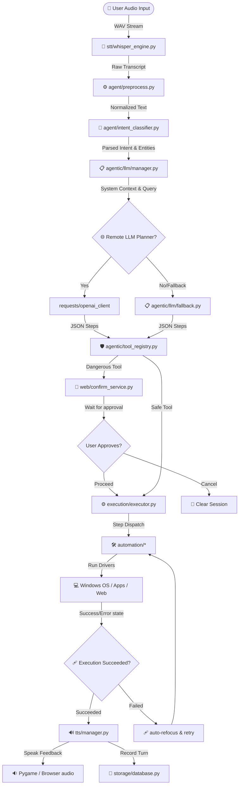

# AI Voice Assistant

A speech-based desktop automation assistant built for Windows. This project translates natural voice commands into sequential operating system execution graphs, automating interactions with desktop applications, web browsers, local filesystems, and messaging clients.

---

## # Project Overview

### What is this project?
This project is a Windows-compatible voice-control application that maps speech or text inputs to executable action graphs (plans) on the host computer. It combines local speech-to-text, pattern-based NLP classifications, external large language model (LLM) planning, and programmatic GUI/web drivers to interact with the OS.

### What problem does it solve?
It eliminates manual user interaction (mouse clicking, keyboard typing, directory navigating, menu searching) for common desktop workflows. By listening to natural commands, it compiles resource locations, launches applications, searches directories, and performs tasks hands-free.

### How does it work?
1. **Audio Capture**: The system monitors the microphone, records spoken audio using `sounddevice`, and detects speech endings via root-mean-square amplitude silence detection.
2. **Speech-to-Text**: The captured WAV file is processed locally by a Faster-Whisper engine, generating a plain-text transcription.
3. **Intent & Entity Processing**: The transcription is normalized (including Hinglish translation). A pattern matcher extracts target slots like application names, query parameters, directory paths, or contacts.
4. **Task Planning**: The system sends the transcript along with compiled system context (installed apps, running processes, bookmarks) to an external OpenAI-compatible planner API. If offline, the request falls back to a rule-based heuristic planner.
5. **Safety Gate**: The generated plan steps are verified against a tool registry. Dangerous operations (e.g. deleting files, sending chat messages) are blocked, and a confirmation request is posted to the Flask web UI.
6. **OS Execution**: Safe steps (or confirmed dangerous steps) are dispatched to automation drivers (PyAutoGUI, Playwright, Win32 APIs).
7. **Feedback**: The execution outcome is converted into conversational English and spoken back to the user via neural Edge-TTS or Pyttsx3.

### Who is it for?
- Power users seeking hands-free desktop control.
- Accessibility developers building system integrations.
- Automation engineers exploring voice-driven OS agent execution.

### How is it different from a basic speech recognizer?
A basic speech recognizer only transcribes audio to text. This assistant parses semantic intents, resolves contextual references (e.g., *"it"*, *"here"*), dynamically indexes the local system to find resource targets, manages stateful execution logs in an SQLite database, stops dangerous operations using confirmation guards, and runs recovery blocks (e.g. taking screenshots and refocusing windows) when steps fail.

---

## # Features

Only features fully implemented in the codebase are listed below:

- **Speech Recognition**: Local Faster-Whisper STT running quantized model inference.
- **Voice Activity Detection**: Real-time microphone capture stopping automatically after a duration of silence.
- **Hinglish Normalization**: Table-driven normalization mapping phonetic slang, typos, and common Hindi phrases to English tokens.
- **Intent Classification**: Keyword scoring and regex pattern mapping to determine user goals, with compound command splitting.
- **Entity Slot Extraction**: Rule-based and regex extraction of parameters (directories, queries, apps, websites).
- **Desktop Resource Discovery**: Background scan daemon caching installed apps (UWP/Indexed), running processes, browser bookmarks/history, and folders.
- **Action Planning**: Remote OpenAI-compatible planning server integration with local fallback rules.
- **Safety Confirmation Gate**: Explicit permission boundary blocking dangerous tools and requiring manual web UI confirmation.
- **Desktop & Win32 Automation**: Focus management, window enumeration, mouse clicks, and keyboard simulator inputs.
- **Browser Automation**: Playwright-driven WhatsApp Web automation and default browser search launches.
- **File Management**: Programmatic directory listings, folder creation, file readings, and deletions.
- **Text-to-Speech Response**: Neural Edge-TTS client with offline system-native Pyttsx3 fallback.
- **SQLite History Log**: Local database tracking sessions, transcripts, intents, plans, and outcomes.

---

## # System Architecture

The following diagram maps the components and data flows implemented in the project codebase:



---

## # Detailed Execution Pipeline

### 1. Audio Capture (stt/audio_capture.py)
- **Purpose**: Capture sound from microphone.
- **Input**: Physical acoustic signals.
- **Output**: Temporary `.wav` file path on disk.
- **Responsible Module**: `stt`
- **Important Functions**: `record()`, `record_until_silence()`
- **Important Classes**: `AudioRecorder`
- **Failure Cases**: No default microphone, sounddevice query failure.
- **Recovery Strategy**: Falls back to warning logs and empty recording blocks.

### 2. Speech-to-Text (stt/whisper_engine.py)
- **Purpose**: Transcribe speech to text.
- **Input**: WAV file path.
- **Output**: `TranscriptionResult` (dict containing transcribed text, language details, and processing times).
- **Responsible Module**: `stt`
- **Important Functions**: `transcribe()`
- **Important Classes**: `WhisperSTT`
- **Failure Cases**: Quantized model binary download failures, CPU float conversion errors.
- **Recovery Strategy**: Outputs empty transcripts and logs warnings.

### 3. Preprocessing (agent/preprocess.py)
- **Purpose**: Clean and translate voice transcriptions.
- **Input**: Raw text string.
- **Output**: Normalized text string.
- **Responsible Module**: `agent`
- **Important Functions**: `normalize_text()`, `tokenize()`
- **Important Classes**: `TextPreprocessor`
- **Failure Cases**: Long strings with non-ASCII symbols.
- **Recovery Strategy**: Keeps raw alphanumeric tokens and discards unmapped symbols.

### 4. Intent & Entity Extraction (agent/intent_classifier.py, agent/entity_extractor.py)
- **Purpose**: Parse goals and parameters.
- **Input**: Normalized string.
- **Output**: `CommandIntent` schema (intent string, entities dict, confidence score).
- **Responsible Module**: `agent`
- **Important Functions**: `classify()`, `extract_entities()`
- **Important Classes**: `IntentClassifier`, `EntityExtractor`
- **Failure Cases**: Sentence matches multiple conflicting patterns.
- **Recovery Strategy**: Splits compound sentences on conjunctions and returns the intent with the highest pattern overlap score.

### 5. Planning Layer (agentic/llm/manager.py, agentic/llm/fallback.py)
- **Purpose**: Generate multi-step execution graphs.
- **Input**: Transcript string and system discovery context dictionary.
- **Output**: `PlannerOutput` containing reasoning and a list of steps.
- **Responsible Module**: `agentic/llm`
- **Important Functions**: `plan()`, `apply_heuristic_fallback()`
- **Important Classes**: `PlannerManager`
- **Failure Cases**: Remote API connection timeouts or JSON schema mismatches.
- **Recovery Strategy**: Gracefully activates `apply_heuristic_fallback()` to run offline rule-based task planning.

### 6. Safety Gate (agentic/tool_registry.py, web/confirm_service.py)
- **Purpose**: Identify and halt hazardous actions.
- **Input**: `PlannerOutput` plan step details.
- **Output**: Execution permit or blocked confirmation UUID.
- **Responsible Module**: `agentic` / `web`
- **Important Functions**: `check_permissions()`, `handle_confirm()`
- **Important Classes**: `PermissionManager`, `PendingActionManager`
- **Failure Cases**: User closes the browser during a safety block.
- **Recovery Strategy**: Ephemeral confirmation states expire automatically after 60 seconds of inactivity.

### 7. Execution Engine (execution/executor.py)
- **Purpose**: Run plan steps sequentially.
- **Input**: `ExecutionPlan` containing action steps.
- **Output**: List of step-by-step execution result logs.
- **Responsible Module**: `execution`
- **Important Functions**: `execute_step()`, `execute()`
- **Important Classes**: `DesktopExecutor`
- **Failure Cases**: Target application is closed, UI focus changes mid-execution.
- **Recovery Strategy**: Launches recovery block: takes screenshot, inspects active window, attempts to launch/refocus target app, and retries the failed step once.

### 8. Automation Layer (automation/*)
- **Purpose**: Interface directly with system resources.
- **Input**: Execution payload arguments.
- **Output**: `ExecutionResult` model.
- **Responsible Module**: `automation`
- **Important Functions**: `open_application()`, `open_browser()`, `open_folder()`, `send_whatsapp_message()`
- **Important Classes**: Programmatic helper functions.
- **Failure Cases**: Playwright chromium context locks, OS lockscreen blocks.
- **Recovery Strategy**: Returns failed `ExecutionResult` to executor to trigger recovery logic.

---

## # Folder Structure

- **`agent/`**: Handles local natural language processing (text-to-intent).
  - *Key Files*: `preprocess.py`, `intent_classifier.py`, `entity_extractor.py`, `command_registry.py`
  - *Used By*: `web/services.py`
  - *Output*: `CommandIntent` structures containing normalized semantic tokens.
- **`agentic/`**: High-level agent routing, LLM planning interfaces, stateful contexts, and discovery tools.
  - *Key Files*: `llm/manager.py`, `discovery/indexer.py`, `memory/session_state.py`
  - *Used By*: `web/services.py`, `execution/executor.py`
  - *Output*: Context parameters, cache registers, background scans, and planned step graphs.
- **`automation/`**: low-level device drivers and automation clients interfacing with the OS.
  - *Key Files*: `applications.py`, `browser.py`, `desktop.py`, `filesystem.py`, `whatsapp.py`
  - *Used By*: `execution/registry.py`
  - *Output*: Direct UI clicks, keyboard inputs, folder paths, file edits, and Chromium automation.
- **`execution/`**: Connects action steps to automation tools.
  - *Key Files*: `executor.py`, `registry.py`, `schemas.py`
  - *Used By*: `web/services.py`
  - *Output*: Programmatic step execution logs and step recovery operations.
- **`storage/`**: Local database layer for history logging.
  - *Key Files*: `database.py`, `history_manager.py`
  - *Used By*: `web/routes.py`, `web/confirm_service.py`
  - *Output*: Persistent SQLite rows of speech and command records.
- **`stt/`**: Input speech processing.
  - *Key Files*: `audio_capture.py`, `whisper_engine.py`
  - *Used By*: `web/services.py`
  - *Output*: String transcriptions.
- **`tts/`**: Output response synthesis.
  - *Key Files*: `manager.py`, `edge_engine.py`, `pyttsx3_engine.py`, `response_generator.py`
  - *Used By*: `web/services.py`
  - *Output*: MP3/WAV files played back locally or served to the web UI.
- **`web/`**: Dashboard frontend and backend REST service endpoints.
  - *Key Files*: `app.py`, `routes.py`, `services.py`, `confirm_service.py`
  - *Used By*: Main application runtime entry point.
  - *Output*: JSON web endpoints and static dashboard rendering.
- **`tests/`**: Main suite validating system state, intents, memory, and mocks.
- **`scripts/`**: Development scripts and standalone utility diagnostics.

---

## # Module Explanation

### 1. `agent/preprocess.py`
- **Purpose**: Translates Hinglish to English, fixes typos, and removes punctuation.
- **Major Classes**: `TextPreprocessor`
- **Major Functions**: `normalize_text()`, `tokenize()`
- **Inputs**: Raw string text.
- **Outputs**: Normalized clean string or token list.
- **Dependencies**: `re`, `logging`
- **Called By**: `agent/intent_classifier.py`
- **Calls Modules**: None

### 2. `agent/intent_classifier.py`
- **Purpose**: Matches normalized text to intents.
- **Major Classes**: `IntentClassifier`
- **Major Functions**: `classify()`, `rank_intents()`
- **Inputs**: Clean normalized string.
- **Outputs**: `CommandIntent` structures.
- **Dependencies**: `re`, `dataclasses`, `agent/command_registry.py`, `agent/entity_extractor.py`
- **Called By**: `web/services.py`
- **Calls Modules**: `agent/command_registry`, `agent/entity_extractor`, `agent/preprocess`

### 3. `agent/entity_extractor.py`
- **Purpose**: Extracts variables from transcripts.
- **Major Classes**: `EntityExtractor`
- **Major Functions**: `extract_entities()`
- **Inputs**: Utterance string and matching intent parameters.
- **Outputs**: Dict of extracted slot values.
- **Dependencies**: `logging`, `re`
- **Called By**: `agent/intent_classifier.py`
- **Calls Modules**: None

### 4. `agent/command_registry.py`
- **Purpose**: Configures supported intents, categories, and patterns.
- **Major Classes**: None
- **Major Functions**: `get_all_intents()`, `get_intent()`, `list_intent_names()`
- **Inputs**: None
- **Outputs**: `IntentDefinition` models.
- **Dependencies**: `agent/schemas.py`
- **Called By**: `agent/intent_classifier.py`
- **Calls Modules**: `agent/schemas`

### 5. `agentic/llm/manager.py`
- **Purpose**: Manages remote planning requests and offline fallbacks.
- **Major Classes**: `PlannerManager`
- **Major Functions**: `plan()`, `_inject_context()`
- **Inputs**: Transcription string.
- **Outputs**: `PlannerOutput` plan step models.
- **Dependencies**: `json`, `requests`, `agentic/llm/fallback.py`, `agentic/discovery/indexer.py`
- **Called By**: `web/services.py`
- **Calls Modules**: `agentic/llm/remote_client`, `agentic/llm/fallback`, `agentic/discovery/indexer`, `agentic/memory/session_state`

### 6. `agentic/llm/fallback.py`
- **Purpose**: Rule-based planner mapping transcriptions to steps when offline.
- **Major Classes**: None
- **Major Functions**: `apply_heuristic_fallback()`
- **Inputs**: Transcript string.
- **Outputs**: `PlannerOutput` plan steps.
- **Dependencies**: `re`, `agentic/llm/schemas.py`, `agentic/discovery/manager.py`
- **Called By**: `agentic/llm/manager.py`
- **Calls Modules**: `agentic/discovery/manager`, `agentic/memory/session_state`

### 7. `agentic/discovery/indexer.py`
- **Purpose**: Background daemon scanning and indexing system apps and folders.
- **Major Classes**: `SystemIndexer`
- **Major Functions**: `start()`, `stop()`, `scan_and_save()`
- **Inputs**: File system directory structures.
- **Outputs**: Caches `system_index.json` resources on disk.
- **Dependencies**: `threading`, `json`, `agentic/discovery/apps.py`, `agentic/discovery/browser.py`, `agentic/discovery/filesystem.py`
- **Called By**: `agentic/llm/manager.py`
- **Calls Modules**: `agentic/discovery/apps`, `agentic/discovery/browser`, `agentic/discovery/filesystem`, `agentic/discovery/processes`

### 8. `agentic/memory/session_state.py`
- **Purpose**: Session state tracking active applications, contacts, and logs.
- **Major Classes**: `SessionState`
- **Major Functions**: `set_context()`, `set_pending_action()`, `add_history()`, `get_session()`
- **Inputs**: Context variables, raw transcripts, execution results.
- **Outputs**: Singleton session instance reference.
- **Dependencies**: `uuid`, `time`, `threading`
- **Called By**: `web/services.py`, `agentic/llm/manager.py`, `execution/executor.py`, `web/confirm_service.py`
- **Calls Modules**: None

### 9. `automation/applications.py`
- **Purpose**: Launches process handles, queries running windows, foregrounds handles.
- **Major Classes**: None
- **Major Functions**: `open_application()`, `is_app_running()`, `bring_process_to_foreground()`, `perform_app_action()`
- **Inputs**: Dict application payloads.
- **Outputs**: `ExecutionResult` reports.
- **Dependencies**: `psutil`, `win32gui`, `win32process`, `subprocess`
- **Called By**: `execution/registry.py`
- **Calls Modules**: `execution/schemas`

### 10. `automation/browser.py`
- **Purpose**: Launches web links and web searches.
- **Major Classes**: None
- **Major Functions**: `open_browser()`, `search_web()`
- **Inputs**: Target URL/query payloads.
- **Outputs**: `ExecutionResult` models.
- **Dependencies**: `webbrowser`
- **Called By**: `execution/registry.py`
- **Calls Modules**: `execution/schemas`

### 11. `automation/filesystem.py`
- **Purpose**: Creates files/folders, reads content, lists files, deletes targets.
- **Major Classes**: None
- **Major Functions**: `create_folder()`, `create_file()`, `list_files()`, `delete_file()`
- **Inputs**: Filename, directory, or path parameters.
- **Outputs**: `ExecutionResult` records.
- **Dependencies**: `os`, `shutil`
- **Called By**: `execution/registry.py`
- **Calls Modules**: `execution/schemas`

### 12. `automation/desktop.py`
- **Purpose**: Low-level keyboard and mouse simulation, screenshot capture, memory check.
- **Major Classes**: None
- **Major Functions**: `click()`, `type_text()`, `press_key()`, `take_screenshot()`, `check_memory()`
- **Inputs**: Coordinates, texts, keys, and file paths.
- **Outputs**: `ExecutionResult` outputs.
- **Dependencies**: `pyautogui`, `psutil`
- **Called By**: `execution/registry.py`
- **Calls Modules**: `execution/schemas`

### 13. `automation/whatsapp.py`
- **Purpose**: Automates sending messages on WhatsApp Web.
- **Major Classes**: None
- **Major Functions**: `send_whatsapp_message()`
- **Inputs**: Dict containing contact and message keys.
- **Outputs**: `ExecutionResult` output status.
- **Dependencies**: `playwright.sync_api`
- **Called By**: `execution/registry.py`
- **Calls Modules**: `execution/schemas`

### 14. `execution/executor.py`
- **Purpose**: Sequentially executes planned stages.
- **Major Classes**: `DesktopExecutor`
- **Major Functions**: `execute_step()`, `execute()`, `_attempt_recovery()`
- **Inputs**: `ExecutionPlan` tasks.
- **Outputs**: Array of outcome dictionary logs.
- **Dependencies**: `time`, `pyautogui`, `agentic/tool_registry.py`, `agentic/memory/session_state.py`
- **Called By**: `web/services.py`
- **Calls Modules**: `execution/registry`, `agentic/memory/session_state`, `automation/desktop`

### 15. `execution/registry.py`
- **Purpose**: Maps string step actions to corresponding automation functions.
- **Major Classes**: None
- **Major Functions**: `register_tool()`, `get_handler()`, `load_all_tools()`
- **Inputs**: Target action string.
- **Outputs**: Function handler.
- **Dependencies**: Python import hooks.
- **Called By**: `execution/executor.py`, `web/confirm_service.py`
- **Calls Modules**: `automation.*`

### 16. `storage/database.py`
- **Purpose**: Handles SQLite CRUD operations.
- **Major Classes**: None
- **Major Functions**: `init_db()`, `insert_session()`, `get_all_sessions()`, `delete_session()`
- **Inputs**: Session details dictionaries.
- **Outputs**: SQL records.
- **Dependencies**: `sqlite3`, `config.py`
- **Called By**: `storage/history_manager.py`
- **Calls Modules**: `config`

### 17. `tts/manager.py`
- **Purpose**: Coordinates voice response generation using edge-tts or pyttsx3.
- **Major Classes**: `TTSManager`
- **Major Functions**: `speak()`
- **Inputs**: Plain text feedback strings.
- **Outputs**: `SpeechResult` structures.
- **Dependencies**: `tts/edge_engine.py`, `tts/pyttsx3_engine.py`
- **Called By**: `web/services.py`
- **Calls Modules**: `tts/edge_engine`, `tts/pyttsx3_engine`

---

## # Technology Stack

The third-party libraries and modules imported by this codebase are outlined below:

- **Python**: Core scripting language used to build the entire system.
- **Flask**: Lightweight WSGI web framework mapping REST API endpoints and serving the static dashboard interface.
- **Flask-CORS**: Handles Cross-Origin Resource Sharing (CORS) configurations for API blueprints.
- **sounddevice**: Interface to PortAudio for microphone monitoring and recording WAV array captures.
- **scipy**: Utilized for `scipy.io.wavfile` to write raw PCM numpy audio arrays into standard WAV containers.
- **numpy**: Performs amplitude calculations to track signal levels during voice activity detection.
- **Faster-Whisper**: Local speech-to-text transcriber leveraging CTranslate2 and transformer quantization.
- **PyTorch**: Used under the hood by Faster-Whisper to load and compute neural speech models.
- **requests**: Handles synchronous HTTP POST payloads sent to the remote Colab LLM Planner endpoint.
- **playwright**: Automates WhatsApp Web through Chromium, enabling hands-free message dispatch.
- **pyautogui**: Simulates cross-platform keyboard presses, typing actions, mouse clicks, and screenshot sweeps.
- **pywin32 (win32gui, win32process, win32com)**: Performs low-level Win32 window handles mapping, foreground assertions, and keyboard events.
- **psutil**: Queries running processes to check if specific applications are running and evaluates RAM usage.
- **SQLite**: Local relational database handling session histories and log parameters.
- **Rich**: Terminal formatting and colored log output prints.
- **pygame**: Provides PCM audio playback wrapper triggers for generated Edge-TTS neural speech audio files.
- **pyttsx3**: Text-to-speech fallback engine executing offline synthetic speech generation.
- **edge-tts**: Async client retrieving high-quality neural voice output audio streams from Microsoft.

---

## # Configuration

Central system parameters are managed inside [config.py](file:///d:/ai%20voice%20assisstant/config.py) and can be overridden using a local `.env` file:

| Variable | Description | Default Value |
| :--- | :--- | :--- |
| `LOG_LEVEL` | Logging verbosity (`DEBUG`, `INFO`, `WARNING`, `ERROR`) | `"INFO"` |
| `COLAB_API_URL` | URL of the remote OpenAI-compatible planning server | `"https://evaluator-agreeing-plenty.ngrok-free.dev/plan"` |
| `COLAB_TIMEOUT` | Network timeout in seconds for planner requests | `120` |
| `STT_MODEL_ID` | Faster-Whisper model ID hosted on Hugging Face | `"deepdml/faster-whisper-large-v3-turbo-ct2"` |
| `STT_BEAM_SIZE` | Decode beam size matching Whisper search | `5` |
| `STT_VAD_FILTER` | Enable VAD filter to strip leading/trailing silence | `True` |
| `SILENCE_THRESHOLD` | Signal threshold value matching VAD stop | `0.01` |
| `SILENCE_DURATION` | Seconds of silence before recording stops | `2.0` |

---

## # Installation Guide

### Prerequisites
- **Operating System**: Windows 10/11
- **Python Version**: Python 3.10.x or 3.11.x (installed and added to PATH)
- **Git**: Installed for cloning the repository

### Setup Steps
1. **Clone the repository**:
   ```powershell
   git clone https://github.com/yourusername/ai-voice-assistant.git
   cd "ai-voice-assistant"
   ```

2. **Create a virtual environment**:
   ```powershell
   python -m venv .venv
   ```

3. **Activate the virtual environment**:
   ```powershell
   .venv\Scripts\activate
   ```

4. **Install pinned dependencies**:
   ```powershell
   pip install -r requirements.txt
   ```

5. **Install Playwright browser binaries**:
   ```powershell
   playwright install chromium
   ```

6. **Create local environment file**:
   ```powershell
   copy .env.example .env
   ```
   Modify `.env` to configure your remote planner URL or change logging parameters if necessary.

7. **Run the API & UI server**:
   ```powershell
   python -m web.app
   ```
   Open your browser and navigate to `http://localhost:5000` to view the active user dashboard.

---

### Troubleshooting Windows Setup

#### 1. Pywin32 / DLL Import Failure
If you receive import errors regarding `win32gui` or `win32process` on startup, force-reinstall `pywin32` inside your virtual environment to register the system DLLs:
```powershell
pip install --force-reinstall pywin32
```

#### 2. Sounddevice / PortAudio Missing Device
If `sounddevice` warns that no input devices are available, ensure that a default microphone is plugged in, active in Windows settings, and not exclusively locked by another program.

#### 3. CUDA Setup
By default, the STT engine checks for GPU drivers. If CUDA is not installed or configured, the system falls back to CPU execution with INT8 quantization, which is functional but slower. To enable GPU acceleration, install CUDA Toolkit 11.x or 12.x matching your PyTorch configuration.

---

## # Usage Examples

These voice commands are mapped via preprocessors, intent patterns, and fallback registries:

- **Open Browser**: *"Open browser"* or *"Browser kholo"*
  - Normalizes to: `browser open`
  - Action Plan: `open_browser()`
- **Open Downloads Folder**: *"Open downloads"*
  - Action Plan: `open_folder(path="Downloads")`
- **Google Search**: *"Search Machine Learning on Google"*
  - Action Plan: `search_web(query="machine learning", application="google")`
- **Open YouTube**: *"Open YouTube"*
  - Action Plan: `open_browser(url="https://youtube.com")`
- **Create Folder**: *"Create folder called documents"*
  - Action Plan: `create_folder(name="documents")`
- **Delete File (Safety Block)**: *"Delete report.pdf"*
  - Action Plan: `delete_file(path="report.pdf")`
  - *Pipeline Stage*: Matches a dangerous tool. Safe execution block interrupts. Flask UI prompt displays: *"Are you sure you want to delete report.pdf?"*. Clicking *Proceed* completes deletion.
- **Open WhatsApp**: *"Open WhatsApp"*
  - Action Plan: `open_application(application="WhatsApp")`
- **Send WhatsApp Message**: *"Message Harshita and write hi"*
  - Action Plan: `send_whatsapp_message(contact="Harshita", message="hi")`
  - *Pipeline Stage*: Triggers safety confirmation. Once approved, Playwright logs into WhatsApp Web and dispatches the message.

---

## # Testing

The project contains a comprehensive unit and integration test suite located in [tests/](file:///d:/ai%20voice%20assisstant/tests).

### What is tested?
- **NLP Preprocessing & Synonym normalizations**: Validates Hinglish translations, whitespace formatting, and typos correction.
- **Intent Pattern Matching**: Asserts intent ranking scores, compound command splits, and slot extraction.
- **Session Memory State & Pending Actions**: Tests confirmation IDs serialization, timeout expirations, and state restoration.
- **Priority App Discovery**: Validates StartApps PowerShell scanning, indexed files lookup, and UWP matches.
- **System Executor Recovery Logic**: Mocks failure states and asserts screenshot capture and retry operations.
- **Web API Endpoints**: Tests Flask routes (`/transcribe`, `/history`, `/speak`, `/confirm`, `/pending`) via client fixtures.

### How to run tests
To run the complete test suite:
```powershell
.venv\Scripts\python -m pytest tests/
```

To run a specific test suite file:
```powershell
.venv\Scripts\python -m pytest tests/test_launch_and_confirm.py
```

---

## # Current Limitations

- **Windows OS Dependency**: Low-level window handle calls (`win32gui`), StartApp discovery, and shortcut indexing rely on Windows APIs, preventing native execution on macOS or Linux.
- **Active UI Focus Required**: PyAutoGUI keyboard simulator dispatches keystrokes and mouse clicks directly to the active foreground screen. If the user clicks away or locks the screen, automated tasks may fail or target the wrong window.
- **No Visual Reasoning (OCR/Vision)**: The assistant lacks computer vision to analyze on-screen elements. It relies on accessibility trees, active process parameters, and pre-calculated window bounds to determine click targets.
- **WhatsApp Web login profile**: Automated messaging requires Playwright to share the Chromium configuration folder, which requires a manual QR code login verification on the first run.
- **Remote Planning dependency**: The default planning engine relies on an active HTTP connection to the external Colab LLM API. The assistant falls back to a rule-based local planner if offline.

---

## # Future Improvements

- **Computer Vision & OCR integration**: Process screen frames dynamically to click text labels and buttons in uncooperative UIs without relying on coordinate estimations.
- **Wake Word Detection**: Integrate a local voice activation listener (e.g. Porcupine or Snowboy) to trigger recording without clicking the dashboard microphone button.
- **Self-Healing Parameter Resolution**: Implement local self-correcting logic that searches for alternate paths or file extensions if an automation step raises a file-not-found error.
- **Cross-Platform Compatibility**: Re-write platform-specific drivers (UWP scanners and win32gui handles) using standard Python packages to enable macOS/Linux execution.
